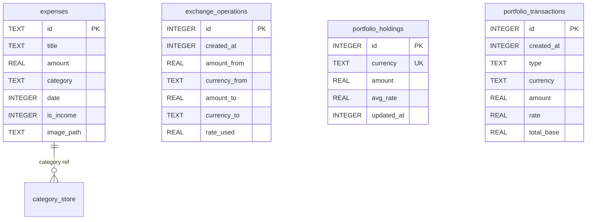

# Общая схема БД FinControl

Единая схема SQLite для тестовой документации и тест-кейсов.

## ER (сущности)

## Таблицы

| Таблица | Назначение |
|---------|------------|
| **expenses** | Расходы и доходы: id, title, amount, category, date, is_income, image_path |
| **exchange_operations** | История операций обменника: created_at, amount_from/to, currency_from/to, rate_used |
| **portfolio_holdings** | Позиции по валютам: currency (UNIQUE), amount, avg_rate, updated_at |
| **portfolio_transactions** | История сделок портфеля: type (buy/sell), currency, amount, rate, total_base |

Дополнительно: категории (встроенные в коде + пользовательские в SharedPreferences), кэш курсов и настройки (тема, базовая валюта) — SharedPreferences.

## Версия БД

- Текущая версия в коде: `_dbVersion = 3` (db.dart).
- Миграции: v1 → expenses; v2 → image_path; v3 → exchange_operations, portfolio_holdings, portfolio_transactions.
