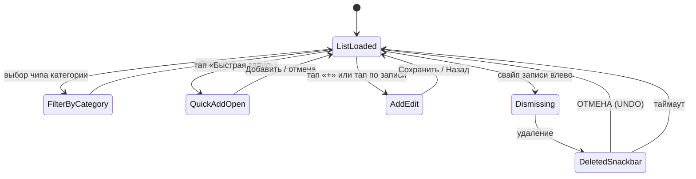
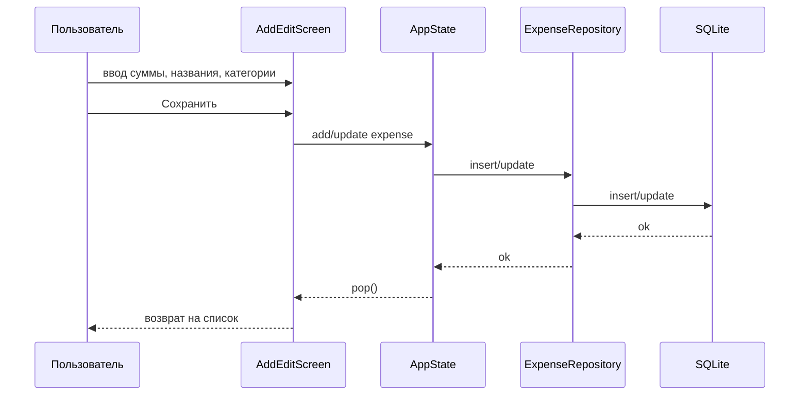

# Фича: Учёт расходов и доходов

## 1. Бизнес-требования

- Пользователь ведёт личный учёт расходов и доходов в одной валюте (рубли).
- Цель — видеть список операций, фильтровать по категориям, быстро добавлять/редактировать/удалять записи и восстанавливать удалённые (UNDO).
- Статистика по категориям и итогам нужна для анализа трат.

## 2. Функциональные требования

| ID | Требование | Приоритет |
|----|------------|-----------|
| FR-1.1 | Добавление записи: сумма, название, категория, дата, опционально фото чека | Высокий |
| FR-1.2 | Редактирование существующей записи (переход по тапу с экрана списка) | Высокий |
| FR-1.3 | Удаление записей свайпом с возможностью отмены (UNDO) | Высокий |
| FR-1.4 | Список с фильтром по категориям (чипы: Все, Еда, Транспорт и т.д.) | Высокий |
| FR-1.5 | Быстрое добавление через bottom sheet (сумма + сохранение с дефолтным названием) | Средний |
| FR-1.6 | Категории: встроенные (Еда, Транспорт, Дом, Досуг, Другое) + пользовательские из настроек | Средний |
| FR-1.7 | Хранение данных локально (SQLite), сохранение между сессиями | Высокий |
| FR-1.8 | Просмотр фото чека (отдельный экран PhotoViewer) | Низкий |

## 3. Нефункциональные требования

| ID | Требование |
|----|------------|
| NFR-1.1 | Время открытия списка и добавления записи — без заметной задержки на типовом устройстве |
| NFR-1.2 | Поддержка тёмной и светлой темы (Material 3) |
| NFR-1.3 | Данные не передаются на внешние серверы (кроме опциональной телеметрии Sentry/AppMetrica) |

## 4. Роли

- **Пользователь** — единственная роль: просматривает, добавляет, редактирует, удаляет свои записи. Регистрации нет, данные локальные.

## 5. Схема БД (учёт расходов)

Таблица **expenses** (SQLite):

| Поле | Тип | Описание |
|------|-----|----------|
| id | TEXT | PRIMARY KEY, UUID записи |
| title | TEXT | NOT NULL, название |
| amount | REAL | NOT NULL, сумма (рубли) |
| category | TEXT | NOT NULL, категория |
| date | INTEGER | NOT NULL, дата/время (Unix ms или аналог) |
| is_income | INTEGER | NOT NULL, 0 = расход, 1 = доход |
| image_path | TEXT | nullable, путь к фото чека |

Категории: встроенные в `lib/core/categories.dart`; пользовательские хранятся в SharedPreferences (`CategoryStore`).

## 6. Диаграммы

### 6.1 Переход состояний экрана «Список расходов» (Home)

### 6.2 Сценарий добавления/редактирования (Add/Edit)

## 7. Связанные тест-кейсы

См. [test-cases.md](../test-cases.md): разделы по `home_screen_test.dart`, `add_edit_screen_test.dart`, `photo_viewer_screen_test.dart`.

## 8. Связанные файлы

- `lib/ui/screens/home_screen.dart`, `add_edit_screen.dart`, `photo_viewer_screen.dart`
- `lib/domain/models/expense.dart`, `lib/domain/repositories/expense_repository.dart`
- `lib/data/db.dart` (expenses), `lib/data/category_store.dart`
- `lib/state/app_state.dart`
