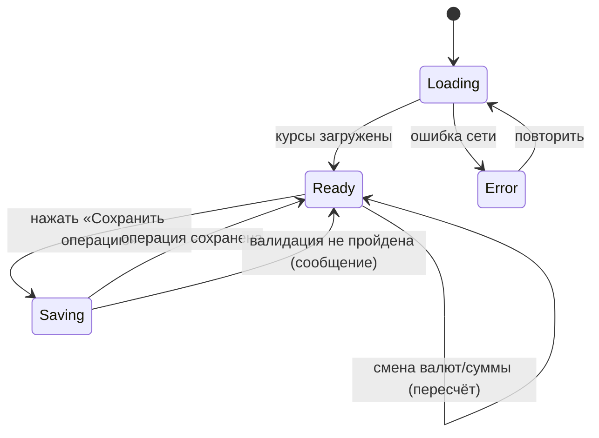
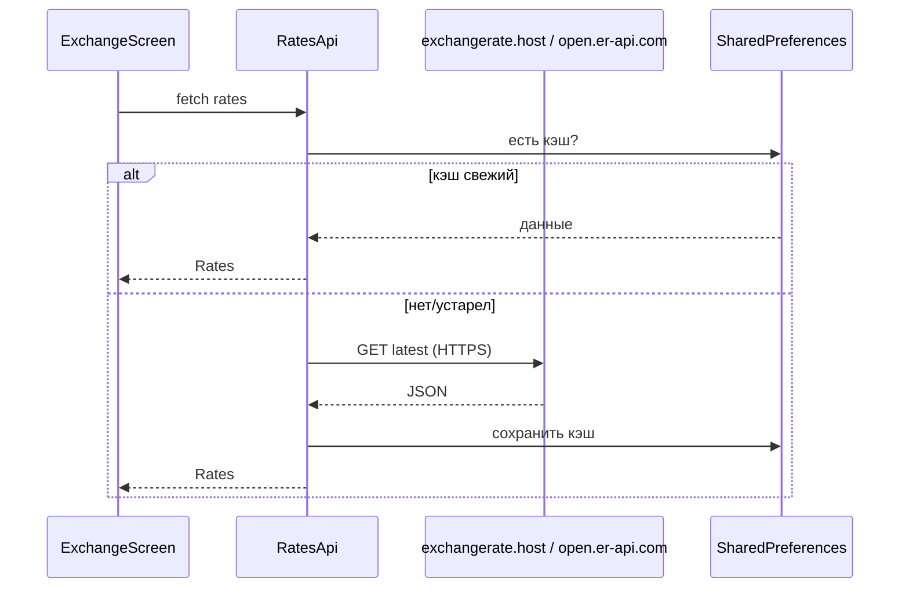

# Фича: Обменник валют

## 1. Бизнес-требования

- Пользователь может рассчитать обмен суммы из одной валюты в другую по актуальному курсу и сохранить операцию в историю.
- Курсы загружаются с публичных API; история операций хранится локально для анализа и тестирования сценариев.

## 2. Функциональные требования

| ID | Требование | Приоритет |
|----|------------|-----------|
| FR-2.1 | Выбор валюты «из» и «в» (RUB, USD, EUR и др. из API) | Высокий |
| FR-2.2 | Ввод суммы «из» и автоматический расчёт суммы «в» по текущему курсу | Высокий |
| FR-2.3 | Отображение актуальных курсов на экране (карточка с курсами, источник и время обновления) | Высокий |
| FR-2.4 | Сохранение операции обмена в историю (дата, сумма из/в, валюты, курс) по кнопке | Высокий |
| FR-2.5 | Список истории операций обмена (локально, SQLite) с возможностью прокрутки | Средний |
| FR-2.6 | Курсы загружаются по HTTPS с публичных API (exchangerate.host, open.er-api.com), кэш в SharedPreferences | Высокий |
| FR-2.7 | Валидация: сумма > 0 при сохранении операции (граничные случаи — см. задание со звёздочкой) | Высокий |

## 3. Нефункциональные требования

| ID | Требование |
|----|------------|
| NFR-2.1 | Запросы к API — HTTPS с явным User-Agent для видимости в Charles/Proxyman |
| NFR-2.2 | При ошибке сети — понятное сообщение пользователю, без падения приложения |
| NFR-2.3 | Поведение при быстром уходе с экрана во время загрузки — без setState after dispose |

## 4. Роли

- **Пользователь (ученик)** — использует обменник и историю; роль одна.

## 5. Схема БД (обменник)

Таблица **exchange_operations** (SQLite):

| Поле | Тип | Описание |
|------|-----|----------|
| id | INTEGER | PRIMARY KEY AUTOINCREMENT |
| created_at | INTEGER | NOT NULL, метка времени (Unix ms) |
| amount_from | REAL | NOT NULL, сумма «из» |
| currency_from | TEXT | NOT NULL, код валюты (RUB, USD, EUR) |
| amount_to | REAL | NOT NULL, сумма «в» |
| currency_to | TEXT | NOT NULL, код валюты |
| rate_used | REAL | NOT NULL, курс на момент операции |

## 6. Диаграммы

### 6.1 Состояния экрана «Обменник»

### 6.2 Загрузка курсов

## 7. Связанные тест-кейсы

См. [test-cases.md](../test-cases.md): ручные тест-кейсы по обменнику; автотесты для обменника при наличии — в соответствующем файле.

## 8. Связанные файлы

- `lib/ui/screens/exchange_screen.dart`, `lib/ui/widgets/rates_card.dart`
- `lib/domain/models/exchange_operation.dart`, `lib/domain/repositories/exchange_repository.dart`
- `lib/data/db.dart` (exchange_operations), `lib/services/rates_api.dart`
