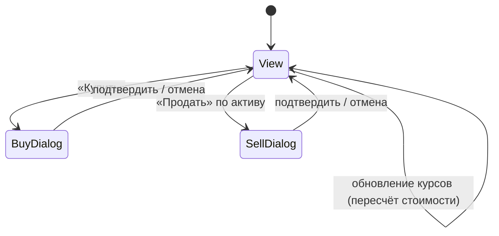
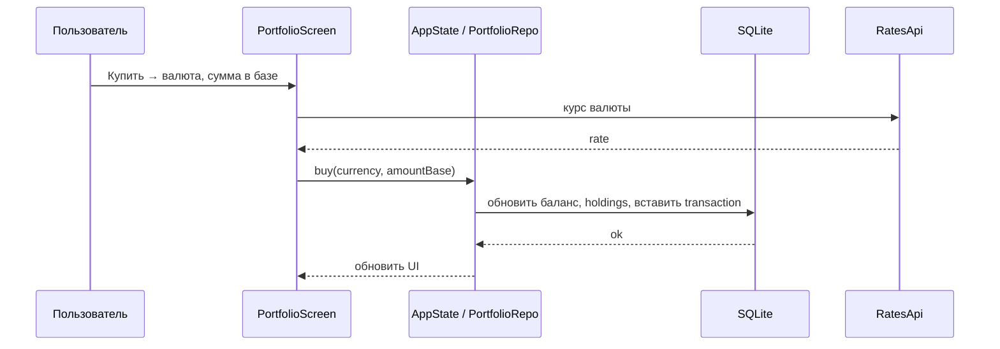

# Фича: Портфель (мини-инвестиции)

## 1. Бизнес-требования

- Пользователь ведёт виртуальный портфель: баланс в базовой валюте (RUB/USD/EUR), покупка и продажа «активов» (валют) по текущему курсу.
- Деньги виртуальные; цель — обучение и тестирование сценариев отображения портфеля, сделок и истории.

## 2. Функциональные требования

| ID | Требование | Приоритет |
|----|------------|-----------|
| FR-3.1 | Отображение текущего баланса в выбранной базовой валюте | Высокий |
| FR-3.2 | Список активов (валют): валюта, количество, средняя цена входа, текущая стоимость в базе | Высокий |
| FR-3.3 | Покупка актива: выбор валюты, сумма в базовой валюте, списание с баланса, зачисление в актив по курсу | Высокий |
| FR-3.4 | Продажа актива: выбор валюты, количество, зачисление в баланс по курсу, списание из актива | Высокий |
| FR-3.5 | История сделок (покупка/продажа): дата, тип, валюта, количество, курс, сумма в базе | Средний |
| FR-3.6 | Курсы для расчёта берутся из того же API, что и в обменнике; защита от деления на ноль при нулевом курсе | Высокий |
| FR-3.7 | Блок «Доходность (PnL)»: общая стоимость, cost basis, нереализованный и реализованный PnL, ROI % (от начального баланса) | Средний |
| FR-3.8 | Блок «Аллокация активов»: доли в % от общей стоимости по валютам и балансу в базовой валюте, визуализация полосками | Средний |

## 3. Нефункциональные требования

| ID | Требование |
|----|------------|
| NFR-3.1 | Расчёты стоимости в базовой валюте без падений при временной недоступности курсов |
| NFR-3.2 | Баланс и позиции хранятся в SQLite, сохраняются между сессиями |

## 4. Роли

- **Пользователь** — единственная роль.

## 5. Схема БД (портфель)

Таблица **portfolio_holdings**:

| Поле | Тип | Описание |
|------|-----|----------|
| id | INTEGER | PRIMARY KEY AUTOINCREMENT |
| currency | TEXT | NOT NULL UNIQUE (USD, EUR и т.д.) |
| amount | REAL | NOT NULL, количество |
| avg_rate | REAL | NOT NULL, средняя цена входа в базовой валюте |
| updated_at | INTEGER | NOT NULL |

Базовая валюта и текущий баланс хранятся в SharedPreferences (например `portfolio_base_currency`, `portfolio_balance`).

Таблица **portfolio_transactions**:

| Поле | Тип | Описание |
|------|-----|----------|
| id | INTEGER | PRIMARY KEY AUTOINCREMENT |
| created_at | INTEGER | NOT NULL |
| type | TEXT | NOT NULL, 'buy' \| 'sell' |
| currency | TEXT | NOT NULL |
| amount | REAL | NOT NULL |
| rate | REAL | NOT NULL |
| total_base | REAL | NOT NULL, сумма в базовой валюте |

## 6. Диаграммы

### 6.1 Состояния экрана «Портфель»

### 6.2 Покупка актива

## 7. Ожидаемое поведение UI

- **Кнопки:** «Купить» (по валюте), «Продать» в карточке актива; в диалогах — «Купить»/«Продать», «Отмена». Подписи полей: «Сумма в …», «Сумма к продаже».
- **Навигация:** экран в нижней навигации; настройки — иконка в AppBar.
- **Сообщения об ошибках:** при ошибке загрузки курсов — экран с текстом «Ошибка загрузки курсов» и кнопкой «Повторить»; при недостатке средств или некорректной сумме — SnackBar («Недостаточно средств», «Некорректная сумма продажи»).
- **Загрузка:** при отсутствии курсов — обновление по кнопке; во время покупки/продажи — кнопки неактивны (блокировка повторного нажатия).
- **Обратная связь:** после сделки — SnackBar («Куплено …», «Продано …»).

## 8. Связанные тест-кейсы

См. [test-cases.md](../test-cases.md): ручные тест-кейсы по портфелю (M-3.1–M-3.6), в т.ч. PnL/ROI (M-3.5) и аллокация активов (M-3.6).

## 9. Связанные практики и критерии приёмки

- **Запросы курсов для расчёта сделок:** практики [Charles](../../practices/01-charles.md), [Proxyman](../../practices/02-proxyman.md); критерии [01-charles](../../acceptance-criteria/01-charles.md), [02-proxyman](../../acceptance-criteria/02-proxyman.md).

## 10. Связанные файлы

- `lib/ui/screens/portfolio_screen.dart`
- `lib/domain/models/portfolio_holding.dart`, `portfolio_transaction.dart`, репозитории
- `lib/data/db.dart` (portfolio_holdings, portfolio_transactions)
