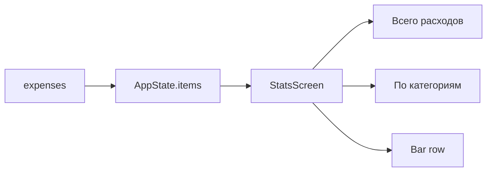

# Фича: Статистика расходов

## 1. Бизнес-требования

- Пользователь видит сводку по расходам и доходам: итоги по категориям и общий итог за выбранный период для принятия решений.

## 2. Функциональные требования

| ID | Требование | Приоритет |
|----|------------|-----------|
| FR-4.1 | Отображение общего итога расходов (сумма всех записей с is_income = 0) | Высокий |
| FR-4.2 | Отображение итога доходов (сумма записей с is_income = 1) | Высокий |
| FR-4.3 | Разбивка по категориям: название категории и сумма (расходы по категориям) | Высокий |
| FR-4.4 | Визуализация: горизонтальные «полоски» (bar_row) по категориям для наглядности | Средний |

## 3. Нефункциональные требования

| ID | Требование |
|----|------------|
| NFR-4.1 | Расчёт на основе локальных данных (AppState/expenses), без задержек при типовом объёме записей |

## 4. Роли

- **Пользователь (ученик)** — единственная роль.

## 5. Схема БД

Используются те же данные, что и для учёта расходов: таблица **expenses**. Агрегация выполняется в приложении (AppState / StatsScreen).

## 6. Диаграммы

### 6.1 Источники данных для статистики

## 7. Связанные тест-кейсы

См. [test-cases.md](../test-cases.md): раздел по `stats_screen_test.dart`.

## 8. Связанные файлы

- `lib/ui/screens/stats_screen.dart`, `lib/ui/widgets/bar_row.dart`
- `lib/state/app_state.dart`, `lib/domain/models/expense.dart`
