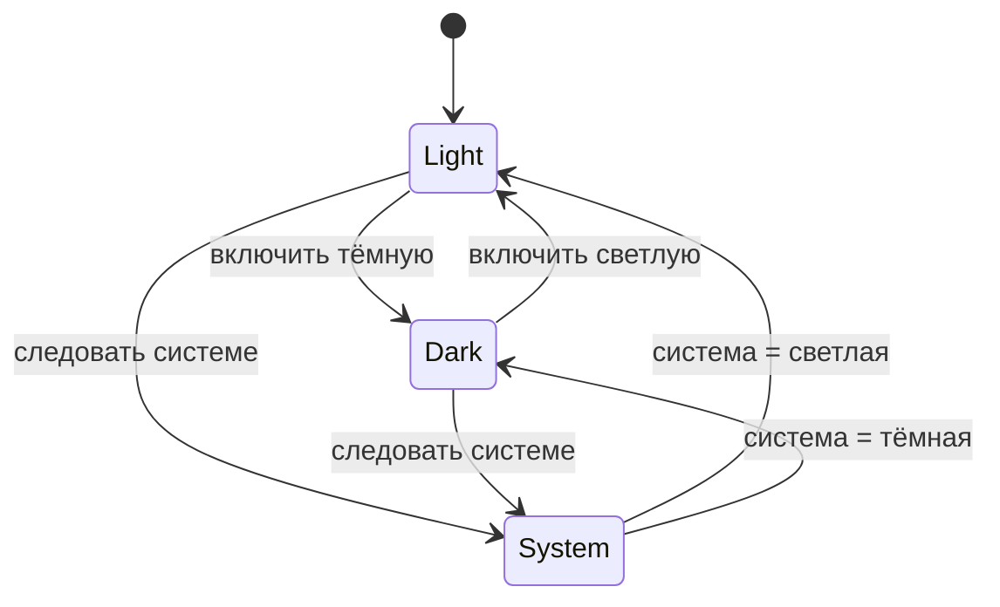

# Фича: Настройки

## 1. Бизнес-требования

- Пользователь может переключать светлую/тёмную тему, выбирать базовую валюту для отображения, очищать кэш курсов и локальные данные (для сброса к чистому состоянию или отладки).

## 2. Функциональные требования

| ID | Требование | Приоритет |
|----|------------|-----------|
| FR-5.1 | Переключатель темы (светлая / тёмная / система) | Высокий |
| FR-5.2 | Выбор базовой валюты (RUB, USD, EUR) для портфеля и отображения | Средний |
| FR-5.3 | Кнопка «Очистить кэш курсов» — сброс кэша курсов в SharedPreferences | Средний |
| FR-5.4 | Кнопка «Очистить все данные» — удаление локальных данных (ожидание: расходы + обмен + портфель; уточнение границ — в [задании со звёздочкой](../../acceptance-criteria/bugs-dlya-ekzamenatora.md)) | Высокий |
| FR-5.5 | При наличии DSN Sentry — кнопка «Тест Sentry» для отправки тестового исключения | Низкий |

## 3. Нефункциональные требования

| ID | Требование |
|----|------------|
| NFR-5.1 | Тема сохраняется (SharedPreferences или аналог) и применяется при следующем запуске |

## 4. Роли

- **Пользователь** — единственная роль.

## 5. Схема БД

- Тема: через `ThemeController` и персист (например SharedPreferences).
- Базовая валюта и кэш курсов: SharedPreferences.
- Очистка данных: вызовы к `AppDatabase` (deleteAll для expenses, очистка exchange_operations, portfolio_holdings, portfolio_transactions — в зависимости от реализации).

## 6. Диаграммы

### 6.1 Переключение темы

## 7. Ожидаемое поведение UI

- **Кнопки и переключатели:** «Тёмная тема» — Switch с подписью «Переключить оформление приложения»; «Очистить все данные», «Тест Sentry» — пункты списка с понятными подзаголовками. В диалоге подтверждения — «Отмена», «Удалить».
- **Навигация:** экран открывается по иконке настроек из AppBar любого экрана; назад — кнопка «Назад».
- **Сообщения об ошибках:** при очистке данных — диалог подтверждения; после очистки — SnackBar «Данные очищены». После «Тест Sentry» — SnackBar «Исключение отправлено в Sentry».
- **Загрузка:** переключение темы применяется сразу; очистка данных может занять момент — затем SnackBar.
- **Обратная связь:** каждое действие (тема, очистка, тест Sentry) сопровождается видимым результатом или сообщением.

## 8. Связанные тест-кейсы

См. [test-cases.md](../test-cases.md): ручные M-5.1–M-5.3, автотесты `settings_screen_test.dart`.

## 9. Связанные практики и критерии приёмки

- **Кнопка «Тест Sentry»:** практика [06-sentry](../../practices/06-sentry.md), критерии [06-sentry](../../acceptance-criteria/06-sentry.md).
- **Firebase** (Crashlytics, FCM, Analytics, Remote Config, Performance, In-App Messaging): практика [10-firebase.md](../../practices/10-firebase.md); критерии [Firebase](../../acceptance-criteria/README.md).

## 10. Связанные файлы

- `lib/ui/screens/settings_screen.dart`
- `lib/state/theme_controller.dart`, `lib/config/student_env.dart` (и телеметрия через `lib/config/telemetry.dart`)
