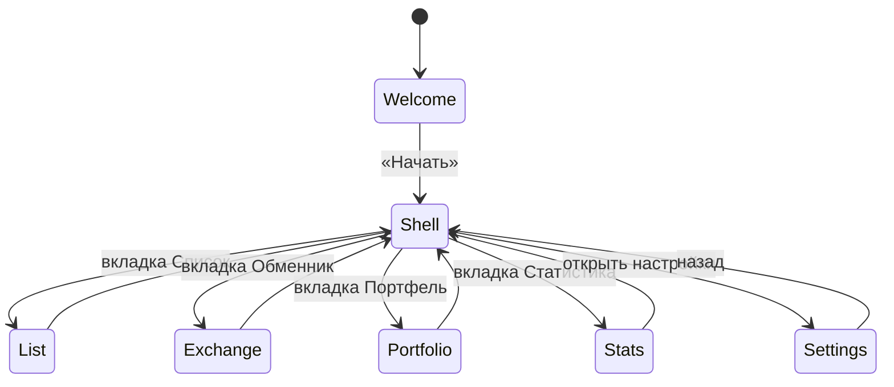
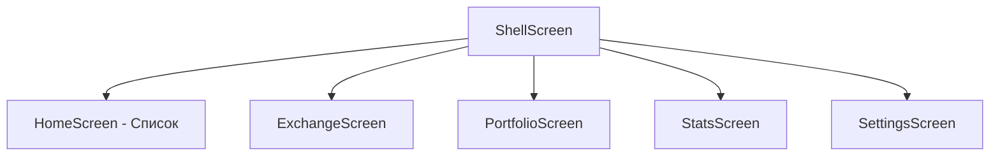

# Фича: Приветствие и навигация

## 1. Бизнес-требования

- При первом запуске пользователь видит приветственный экран с названием приложения и кратким описанием; по кнопке «Начать» переходит в основное приложение с нижней навигацией.
- Навигация между разделами: Список (расходы), Обменник, Портфель, Статистика, Настройки (через Shell).

## 2. Функциональные требования

| ID | Требование | Приоритет |
|----|------------|-----------|
| FR-6.1 | Экран приветствия: заголовок FinControl, подзаголовок о возможностях, кнопка «Начать» | Высокий |
| FR-6.2 | После «Начать» — переход на Shell (нижняя навигация), повторный показ приветствия при следующем запуске не требуется (одноразовый вход) | Высокий |
| FR-6.3 | Shell: вкладки «Список», «Обменник», «Портфель», «Статистика»; настройки доступны (иконка или пункт) | Высокий |
| FR-6.4 | Переключение вкладок без потери состояния экранов (индексы/виджеты) | Средний |

## 3. Нефункциональные требования

| ID | Требование |
|----|------------|
| NFR-6.1 | Быстрый отклик на тап «Начать» и переключение вкладок |

## 4. Роли

- **Пользователь** — единственная роль.

## 5. Схема БД

Не используется; маршруты в `lib/core/routes.dart`, `app_router.dart`.

## 6. Диаграммы

### 6.1 Навигация приложения

### 6.2 Структура Shell

## 7. Связанные тест-кейсы

См. [test-cases.md](../test-cases.md): разделы по `app_boot_test.dart`, `welcome_screen_test.dart`, `shell_screen_test.dart`.

## 8. Связанные файлы

- `lib/main.dart`, `lib/app.dart`, `lib/core/app_router.dart`, `lib/core/routes.dart`
- `lib/ui/screens/welcome_screen.dart`, `lib/ui/screens/shell_screen.dart`
